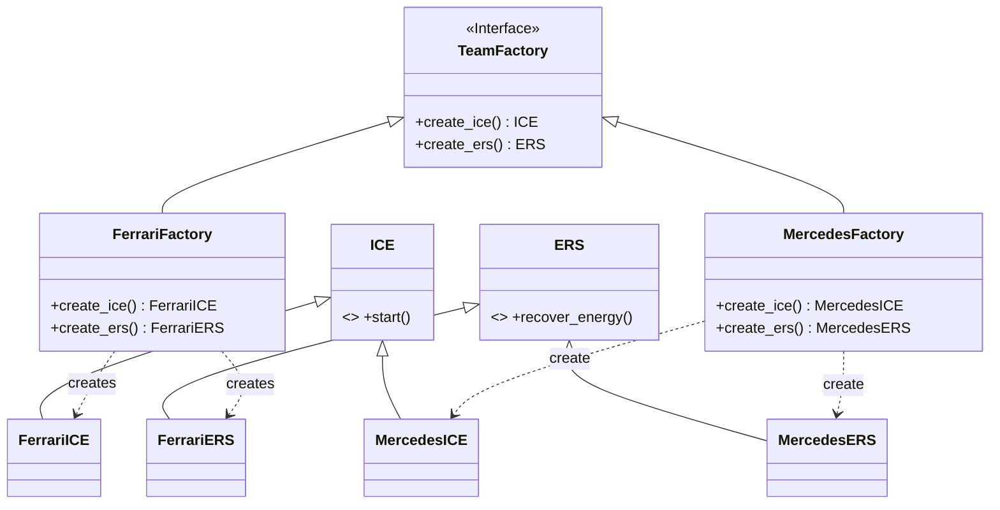
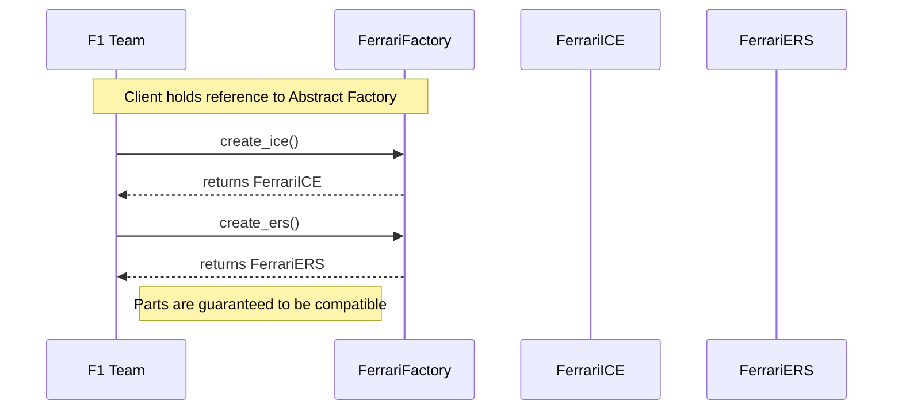

# Pattern Specification: Abstract Factory

## 🏎️ F1 Context: The Power Unit Ecosystem

Modern F1 cars run on complex Power Units. A Power Unit is not a single block but a system of tightly coupled components:

1. **The ICE (Internal Combustion Engine):** The V6 Turbo.
2. **The ERS (Energy Recovery System):** The battery and electric motors (MGU-K, MGU-H).

**The Problem:**
A team cannot mix and match. If Haas buys a Ferrari ICE, they *must* also use the Ferrari ERS. The components must be compatible.

## 🎯 Objective

Provide an interface for creating families of related or dependent objects (ICE + ERS) without specifying their concrete classes.

---

## 🛠️ Functional Requirements

### 1. Abstract Products

Define interfaces for the individual components.

* **`ICE` (Interface):**
  * Method `start()`: Returns a sound string.
* **`ERS` (Interface):**
  * Method `recover_energy()`: Returns a status string (e.g., "Recovering 2MJ").

### 2. Abstract Factory

Define the interface that creates the suite of products.

* **`TeamFactory` (Interface):**
  * Method `create_ice()` -> Returns an `ICE` object.
  * Method `create_ers()` -> Returns an `ERS` object.

### 3. Concrete Factories (The Families)

* **`FerrariFactory`**: Creates `FerrariICE` and `FerrariERS`.
* **`MercedesFactory`**: Creates `MercedesICE` and `MercedesERS`.

### 4. Client Code

The client (The Chassis) asks for a factory (e.g., "Ferrari") and then uses that factory to assemble the car. It never uses `new FerrariICE()` directly.

---

## 📊 Diagrams

### Class Diagram

Notice how the factories group the products into vertical "families".

### Sequence Diagram

The client gets a factory and then requests both parts.

