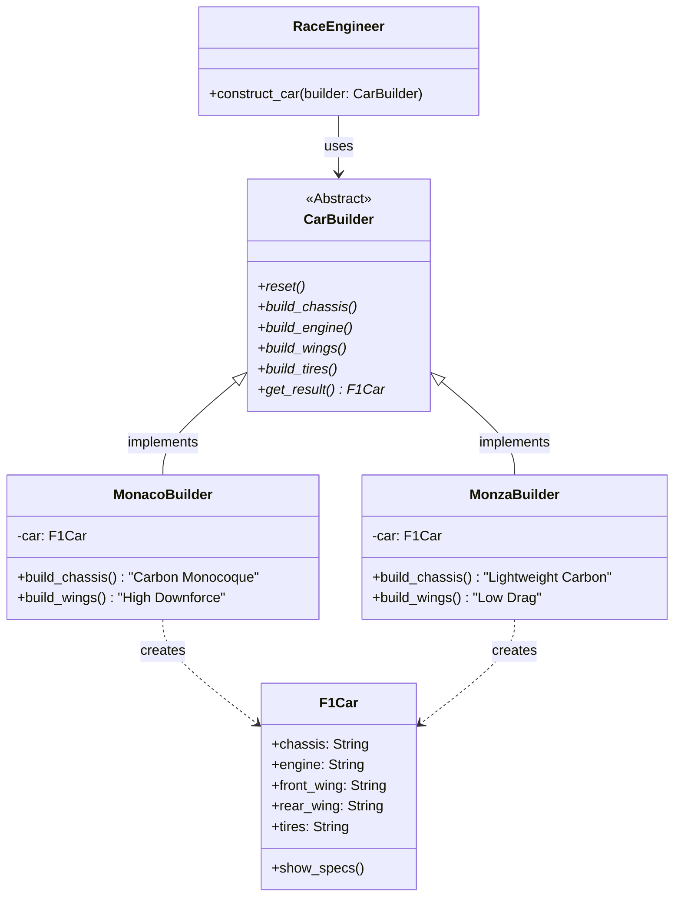
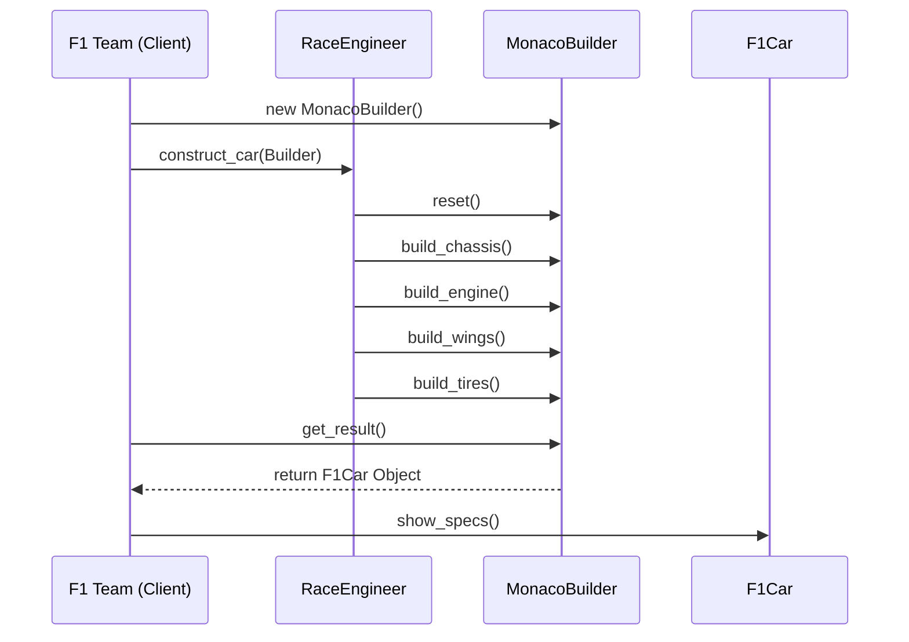

# Pattern Specification: Builder

## 🏎️ F1 Context: Car Configuration (Race Setup)

An F1 car is a complex machine consisting of hundreds of parts. When preparing for a race weekend, teams don't just "create" a generic car. They assemble a specific configuration based on the track's characteristics.

For **Monaco**, they need a "High Downforce" setup (large wings, soft suspension). For **Monza**, they need a "Low Drag" setup (slim wings, maximum top speed). The **process** of building the car remains the same (attach engine, fit wings, set suspension), but the **components** used in those steps differ.

## 🎯 Objective

Separate the construction of a complex object (`F1Car`) from its representation. By using the same construction process, we can create different configurations. This avoids a "telescoping constructor" (a constructor with too many parameters) and provides better control over the assembly steps.

## 🛠️ Functional Requirements

### 1. The Product (`F1Car`)

The complex object that is being constructed. It should have a way to display its final configuration.

**Attributes:** `chassis`, `engine`, `front_wing`, `rear_wing`, `tires`.

**Method:** `show_specs()`: Prints a summary of the car's components.

### 2. The Builder Interface (CarBuilder)

An abstract interface (or ABC) that defines the steps to build the product.

- Methods:
  - `reset()`: Starts a fresh car instance.
  - `build_chassis()`
  - `build_engine()`
  - `build_wings()`
  - `build_tires()`
  - `get_result()`: Returns the finished `F1Car` object.

## 3. Concrete Builders

Implementations of the construction steps for specific race setups.

- `MonacoBuilder`: Sets up a car with "Maximum Downforce" wings and "Hyper Soft" tires.
- `MonzaBuilder`: Sets up a car with "Skinny/Low Drag" wings and "Hard" tires for high-speed stability.

## 4. The Director (`RaceEngineer`)

The Director is responsible for executing the building steps in a particular sequence. It defines `how` to build (the order), while the Builder defines `what` is being built.

- **Method:** `construct_car(builder)`: Calls the builder methods in the correct order to produce a race-ready car.

## 📊 Diagrams

### Class Diagram

The `Director` uses the `Builder` interface. The `ConcreteBuilder` creates and assembles the `F1Car` product.

### Sequence Diagram

The client interacts with the `Director` and the `Builder` to get the final product.

