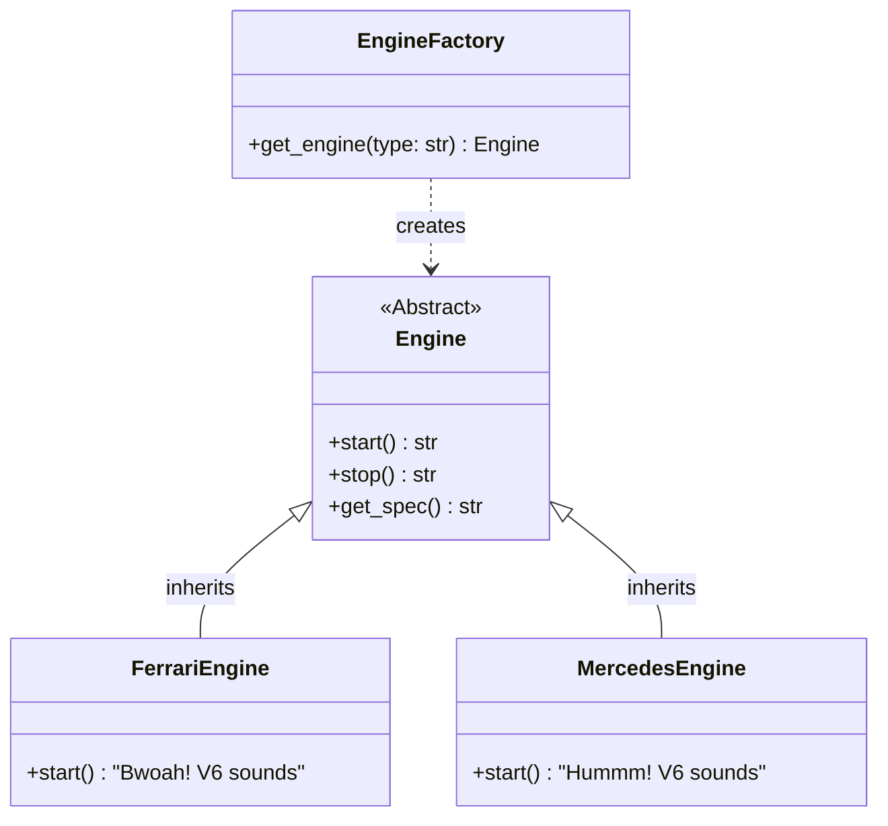
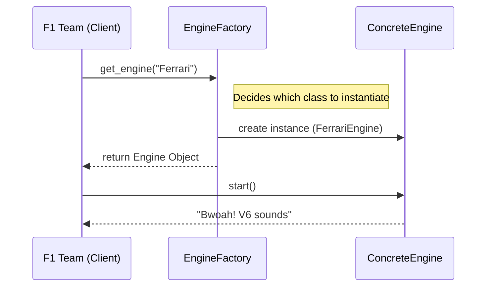

# Pattern Specification: Factory

## 🏎️ F1 Context: Engine Suppliers

In Formula 1, teams (like McLaren, Haas, or Williams) do not manufacture their own engines. They purchase power units from suppliers like **Ferrari**, **Mercedes**, or **Red Bull Powertrains**.

A team needs to integrate an engine without knowing the complex internal details of how that specific engine is built. The team simply requests an engine (e.g., "We need the Ferrari Spec"), and the system provides the correct object.

## 🎯 Objective

Define an interface for creating an object (the Engine), but let subclasses or a dedicated factory method decide which class to instantiate. This allows the F1 Team code to remain loosely coupled from the specific engine implementation.

---

## 🛠️ Functional Requirements

### 1. The Product Interface (Engine)

Define a common interface (Abstract Base Class) that all engines must share.

* **Component:** `Engine` (Abstract)
* **Methods:**
  * `start()`: Returns a string simulating the engine start sound.
  * `stop()`: Returns a string simulating the engine shutdown.
  * `get_spec()`: Returns the technical specifications (e.g., "V6 Turbo Hybrid - Ferrari").

### 2. Concrete Products

Implement at least two distinct engine types that inherit from the base `Engine`.

* **`FerrariEngine`**: High performance, aggressive sound.
* **`MercedesEngine`**: Reliable, distinct sound.
* **`RedBullEngine`** (Optional): Another variant for testing.

### 3. The Creator (The Factory)

Implement a mechanism to generate these engines based on a parameter.

* **Method:** `get_engine(manufacturer_name)`
* **Logic:**
  * Input "Ferrari" -> Returns instance of `FerrariEngine`.
  * Input "Mercedes" -> Returns instance of `MercedesEngine`.
  * Unknown Input -> Raises `ValueError`.

---

## 📊 Diagrams

### Class Diagram

The abstract `Engine` guarantees that every concrete engine has a `start()` method. The Factory handles the creation logic.

### Sequence Diagram

How a client (The Team) requests an engine without knowing the class name.

