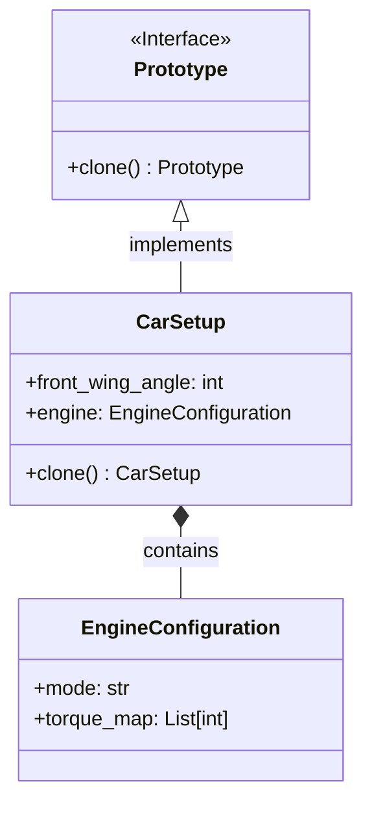
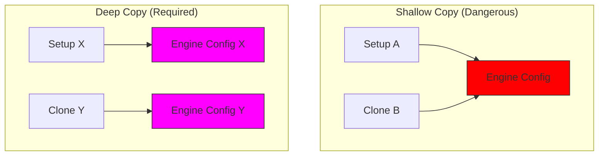

# Pattern Specification: Prototype

## 🏎️ F1 Context: Car Telemetry & Setup

Before a race, the engineering team calculates a complex **Car Setup**. This includes:

1. **Aerodynamics:** Front Wing Angle (Simple Value).
2. **Engine Mapping:** A complex object containing fuel flow curves and torque maps.
3. **Tyre Pressure:** PSI values.

**The Problem:**
Creating a `CarSetup` from scratch involves heavy database queries and physics simulations.
When the second driver needs a setup, or when the team wants to simulate "What if?" scenarios, it is computationally expensive to re-calculate everything.

## 🎯 Objective

Create new objects by copying an existing instance (the "Prototype") rather than creating new instances from scratch. Crucially, this must be a **Deep Copy**—modifying the clone's Engine Mapping must *not* affect the original car.

---

## 🛠️ Functional Requirements

### 1. The Prototype Interface

Define a protocol or base class that declares a `clone()` method.

### 2. Complex Sub-Components

To verify "Deep Copy" behavior, the Setup must contain a nested mutable object.

* **Class `EngineConfiguration`**:
  * Attribute: `mode` (e.g., "Qualifying", "Race", "Save").
  * Attribute: `torque_map` (List of integers).

### 3. The Concrete Prototype (`CarSetup`)

* **Attributes:**
  * `front_wing_angle` (int).
  * `tyre_pressure_psi` (float).
  * `engine` (Instance of `EngineConfiguration`).
* **Method `clone()`**:
  * Must return a new `CarSetup` instance.
  * Must ensure that the `engine` object is also copied (recursive/deep copy).

---

## 📊 Diagrams

### Class Diagram

The `CarSetup` implements the logic to clone itself.

### Object Diagram: Deep vs. Shallow Copy

This illustrates why a standard copy isn't enough. We need the Deep Copy (Right side) to ensure safety.

