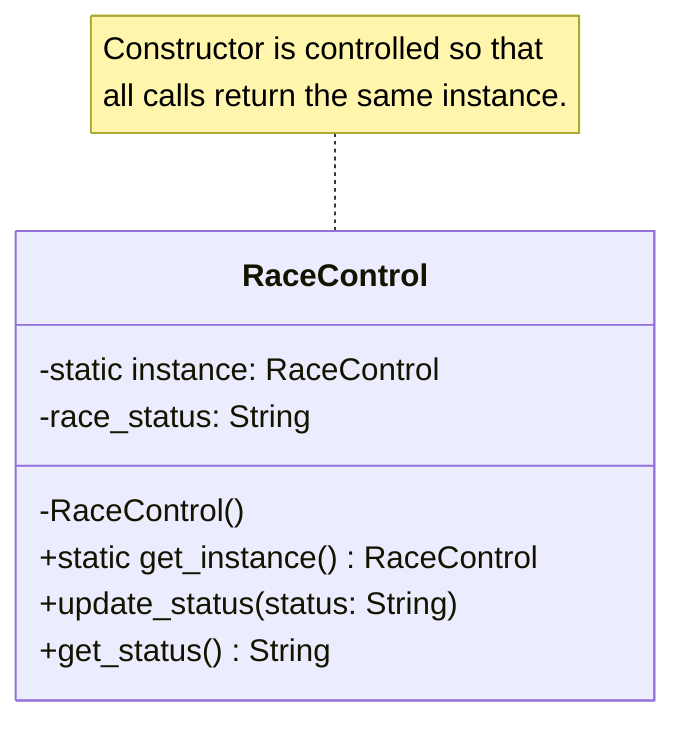
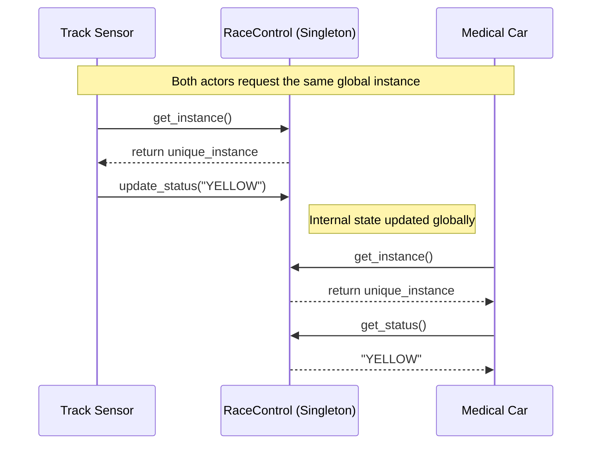

# Pattern Specification: Singleton

## 🏎️ F1 Context: FIA Race Control

In the Formula 1 simulation, the **Race Control (FIA)** is the supreme authority. To ensure sporting integrity and safety, there must be **exactly one** central instance of Race Control managing the track. Multiple instances would lead to inconsistent race states (e.g., one system signaling a "Red Flag" while another signals "Green"), which could be catastrophic in a race environment.

## 🎯 Objective

Implement a mechanism that guarantees a class has only one instance and provides a global point of access to it.

---

## 🛠️ Functional Requirements

### 1. Instance Control

* **Creation Constraint:** Prevent the creation of multiple instances through standard instantiation (e.g., hide/disable the constructor or use logic to return the existing instance).
* **Access Point:** Provide a static property or method to retrieve the unique instance.

### 2. State & Logic

The singleton class must manage the following:

* **Attribute `RaceStatus`**: A variable storing the current track condition.
  * *Allowed values:* `GREEN`, `YELLOW`, `RED`, `SAFETY_CAR`.
  * *Default:* `GREEN`.
* **Method `UpdateStatus(value)`**: Updates the `RaceStatus`.
* **Method `GetStatus()`**: Returns the current `RaceStatus`.

### 3. Concurrency

* **Thread-Safety**: The implementation must be thread-safe. Accessing or updating the status from multiple concurrent threads (e.g., simultaneous telemetry streams from different cars) must not result in the creation of multiple instances or race conditions.

---

## 🧪 Verification Steps (Language Independent)

To confirm the implementation is correct, the test code in each language must:

1. **Uniqueness Test**: Attempt to create/request two instances (e.g., `ctrl1` and `ctrl2`).
2. **Identity Check**: Verify that both instances point to the same object in memory (Identity equality).
3. **State Consistency**: Change the status to `RED` via `ctrl1` and verify that `ctrl2.GetStatus()` also returns `RED`.

---

## 📊 Diagrams

### Class Diagram

The structure below shows how the `RaceControl` manages its own instance and encapsulates the race state.

### Sequence Diagram

This shows how different actors in the F1 ecosystem interact with the **same** instance, ensuring a "Single Source of Truth."

